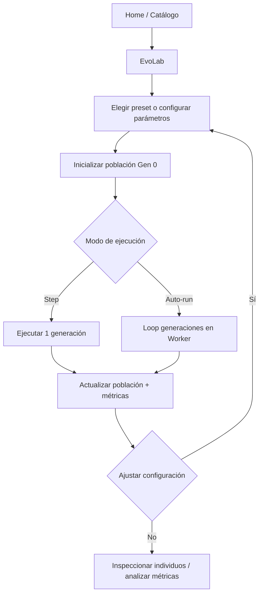
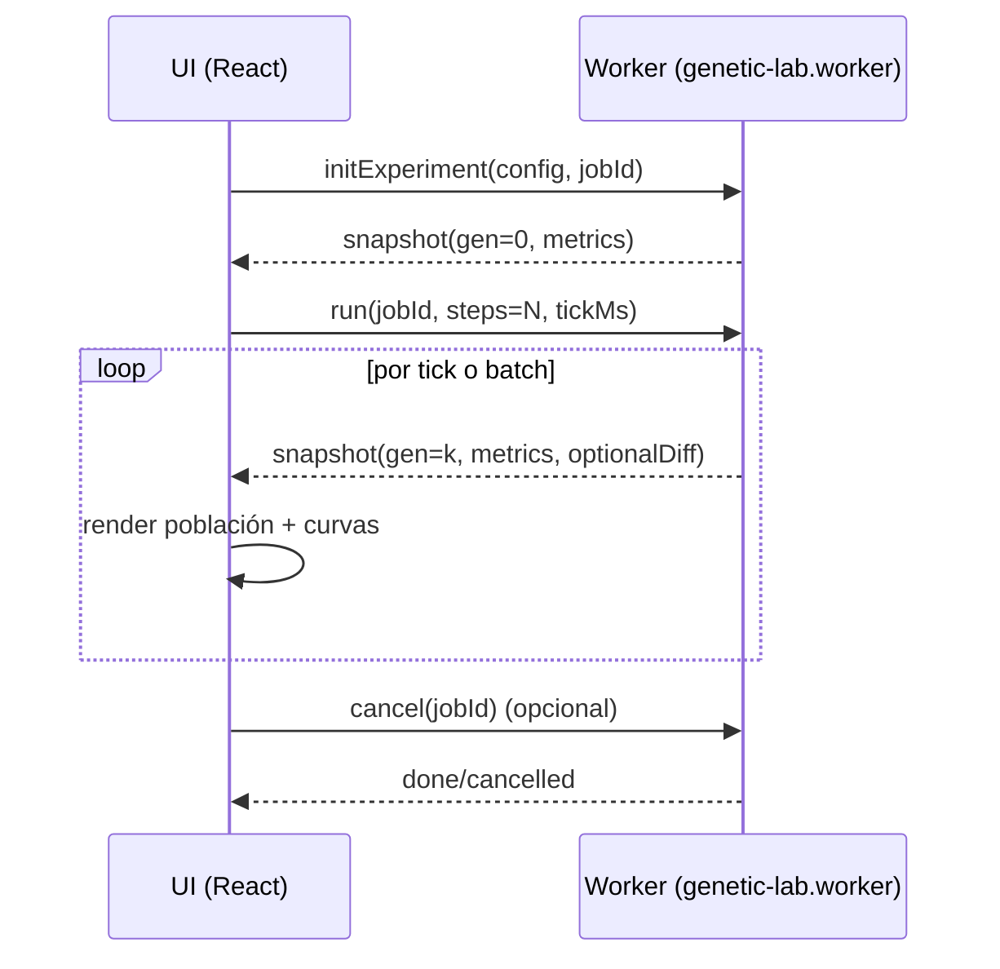

# EvoLab — design.md

## Resumen ejecutivo

EvoLab es una nueva mini app interna para el repo **ludario** que se publicará como ruta `/#/tools/evo-lab` (vía `HashRouter`) y funcionará como un **laboratorio interactivo** para experimentar con algoritmos generacionales (enfoque inicial: **algoritmos genéticos / evolutivos**), visualizando cómo cambian generaciones de una población bajo distintos operadores (selección, cruce, mutación) y distintas funciones de fitness. citeturn9view3turn6view1turn24view2

El repositorio ludario ya está diseñado como un hub de herramientas ligeras que corren completamente en el navegador, con una Home que actúa como “biblioteca” y un catálogo mantenido en una sola grilla filtrable, con favoritos persistidos en `localStorage`. Esto encaja naturalmente con EvoLab como una tool más del catálogo (sin backend y sin cuentas). citeturn6view1turn24view0turn11view1

Técnicamente, el proyecto usa React + TypeScript, bundling con Vite, ruteo con React Router + `HashRouter`, tests con Vitest y deploy automatizado a GitHub Pages. EvoLab se integrará siguiendo las convenciones ya documentadas: UI en `src/pages/`, lógica pura reutilizable en `src/lib/` y cómputo intensivo en `src/workers/` (como `Chinchón Lab`, que usa Web Worker + cancelación por `jobId` y “yields” para no bloquear la UI). citeturn6view0turn6view1turn5view3turn16view0turn16view1

El documento está escrito en Markdown plano y autocontenido, inspirado en el espíritu de `DESIGN.md` (documento de design system que pueden leer agentes) que difunde entity["organization","VoltAgent","opensource org"] en su colección. citeturn21view0turn25view0

## Contexto técnico

### Stack, dependencias y build

El stack declarado por el repo incluye React 18, TypeScript (en modo strict según el README), Vite 5, React Router 6 con `HashRouter`, estilos con mezcla de CSS global + hojas dedicadas + CSS Modules puntuales, testing con Vitest, y deploy por GitHub Actions a GitHub Pages. citeturn24view2turn6view1turn6view0

En `package.json`, las dependencias principales son `react`, `react-dom` y `react-router-dom`, con toolchain `typescript`, `vite`, `@vitejs/plugin-react` y `vitest`. citeturn5view3

El build corre `tsc -b` y luego `vite build`. citeturn5view5

### Ruteo y publicación en GitHub Pages

La app se monta en `HashRouter` desde `src/main.tsx`, lo que implica que una ruta como `/tools/evo-lab` se consumirá como `/#/tools/evo-lab` cuando se publique en Pages. citeturn8view2turn9view3

`vite.config.ts` fija `base: '/ludario/'`, condición relevante para paths y assets cuando se corre en el subpath del sitio en GitHub Pages. citeturn5view7turn5view1

### Estructura de carpetas y separación UI / lógica / workers

El repo documenta y usa una estructura estable:

- `src/pages/`: pages por herramienta (Home y tools).
- `src/lib/`: lógica de negocio y helpers reutilizables (idealmente testeable).
- `src/workers/`: Web Workers para tareas pesadas.
- `src/styles/`: CSS global y hojas dedicadas (incluye utilidades visuales del “lab”).
- `src/components/`: componentes transversales (ej.: botón flotante para volver a Home). citeturn6view0

Una convención explícita del repo es **preferir lógica de negocio en `src/lib/`** y mantener pages como composición de UI + estado de vista. Si una page crece, se sugiere crear subcarpeta bajo `src/pages/<tool>/`. citeturn6view0

### Catálogo, favoritos y prefetch

El catálogo de Home se define en `src/lib/home-catalog.ts` con tipos `InternalCatalogItem` y `ExternalCatalogItem`, y una lista `CATALOG_ITEMS` que incluye tags, chips, colección, estilo de cover, etc. citeturn9view0

Home persiste favoritos en `localStorage` y tiene lógica de migración de keys. citeturn11view1turn11view3

El repo usa lazy loading de pages con imports dinámicos declarados en `src/lib/page-loaders.ts`, y expone `prefetchRoute(path)` para precargar rutas desde la UI. citeturn9view2turn8view6

El botón flotante de retorno (`HomeCornerButton`) también “calienta” Home usando `prefetchRoute('/')`. citeturn11view6turn6view1

### Componentes y estilos reutilizables para “labs”

Hay un set ya consolidado para pantallas densas tipo laboratorio:

- Componentes React reutilizables en `src/pages/chinchon-lab/Layout.tsx`: `LabTabBar`, `LabPanel`, `LabAccordionSection`, `StickyActionBar`. citeturn13view0
- Clases CSS globales en `src/styles/chinchon-arena-utilities.css` (ej.: `.lab-tabs`, `.lab-tab`, `.lab-panel`, `.lab-accordion`, `.lab-action-bar`). citeturn11view7turn11view8
- `main.tsx` importa explícitamente `./styles/chinchon-arena-utilities.css` además de `site.css`, por lo que EvoLab puede apoyarse en estas utilidades sin sumar imports extra globales. citeturn8view3turn9view3

### Patrón de Web Worker existente

`Chinchón Lab` usa un Worker con:

- Mensajes tipados (request/response) en un archivo propio de tipos (`src/lib/chinchon-lab-worker-types.ts`). citeturn16view2turn16view3
- Cancelación por `jobId` (mensaje `cancel`) y “yields” usando `await new Promise(resolve => setTimeout(resolve, 0))` para dar aire al event loop y procesar mensajes. citeturn16view0turn16view1

EvoLab debe adoptar el mismo patrón para simular generaciones de forma fluida y cancelable. citeturn6view1turn16view0turn16view1

## Propuesta

### Nombre, ruta y posicionamiento en ludario

**Nombre**: EvoLab  
**Ruta**: `/#/tools/evo-lab`  
**Tipo**: tool interna (aparece en catálogo de Home y tiene route interna). citeturn24view1turn9view0turn9view3

EvoLab se posiciona como una herramienta “lab” similar en densidad conceptual a `Chinchón Lab` (pero enfocada en evolución artificial) y alineada con la definición de ludario como hub sin instalación ni cuenta. citeturn6view1turn24view0

### Objetivo

Permitir que el usuario:

- configure y ejecute un algoritmo genético / evolutivo,
- observe cómo evoluciona una población,
- vea el efecto real de la selección, el cruce y la mutación,
- compare parámetros (ej.: torneo vs ruleta, mutación alta vs baja) con **métricas y visualización**.

En algoritmos genéticos, el flujo típico incluye población inicial, evaluación de fitness, selección, recombinación/cruce y mutación por generaciones. citeturn22search3turn22search8

### Alcance

**Alcance MVP (recomendado)**:  
Un problema altamente visual y didáctico, con genotipo binario y fitness simple:

- **“Target BitGrid”**: cada individuo es una grilla binaria (ej. 8×8 → 64 genes) que intenta parecerse a un patrón objetivo; el fitness es la cantidad de bits correctos (o, equivalentemente, distancia de Hamming invertida). La representación binaria es un ejemplo clásico en introducciones a AG, y facilita explicar mutación tipo “bit-flip”. citeturn22search3turn22search8turn22search14

**Alcance recomendado (v1+)**:  
Agregar problemas “enchufables” bajo una interfaz `ProblemDefinition`, por ejemplo:

- optimización de función simple (1D) codificada binariamente,
- modo de “selección interactiva” (fitness humano) como variante experimental (sin restricción). Esto es útil cuando el fitness es difícil de formalizar de forma automática. citeturn22search15turn22search3

**Alcance fuera del MVP (opcional)**:  
Comparador de corridas, export/import, heatmaps de diversidad por gen, etc. (ver requisitos).

## Requisitos funcionales

La priorización usa tres niveles: **Obligatorios**, **Recomendados**, **Opcionales**. Lo no especificado por el repo o por el pedido se considera **sin restricción** y se explicita en “Supuestos y notas”.

### Tabla de requisitos

| Prioridad | Requisito | Descripción clara | Criterio de aceptación |
|---|---|---|---|
| Obligatorio | Crear experimento | Crear una configuración (problema + parámetros del GA) y generar una población inicial. | Existe un formulario; al confirmar, se muestra Gen 0 lista para correr. |
| Obligatorio | Controlar ejecución | Controles: **Iniciar**, **Pausar**, **Step (1 gen)**, **Reset**. | Step avanza exactamente 1 generación; Pausar detiene el auto-run sin perder el estado. |
| Obligatorio | Ejecución no bloqueante | La simulación corre en Worker (main thread estable). | UI sigue respondiendo durante runs largos; se puede cancelar. |
| Obligatorio | Visualizar población | Renderizar individuos (mosaico) y permitir seleccionar uno para inspección. | Se ve una grilla de individuos; click abre inspector. |
| Obligatorio | Visualizar mejor individuo | Mostrar “best of generation” y su comparación con el objetivo (si aplica). | Siempre visible; cambia con las generaciones. |
| Obligatorio | Mostrar curvas de fitness | Mostrar best/avg/worst por generación con actualización incremental. | Curvas aumentan con el tiempo; se reinician al reset. |
| Obligatorio | Semilla reproducible | Campo `seed` para corridas reproducibles. | Misma seed + config → mismos resultados (determinismo del motor). |
| Obligatorio | Validación de parámetros | Validar rangos (población, tasas, elitismo, etc.). | Inputs inválidos bloquean run; si hay clamp, se explica al usuario. |
| Recomendado | Presets del lab | Botones para cargar presets (balanceado, exploración, convergencia). | Un click carga parámetros y describe el objetivo del preset. |
| Recomendado | Historial acotado | Guardar N generaciones recientes para scrubber/rewind. | Slider permite volver atrás hasta el límite; se limita memoria. |
| Recomendado | Métricas de diversidad | Calcular diversidad genética y visualizarla. | Se muestra un indicador de diversidad que cambia. |
| Recomendado | Explicación didáctica integrada | Panel breve explicando selección/cruce/mutación según configuración actual. | Cambia al cambiar el método (ej. torneo vs ruleta). |
| Opcional | Comparador de corridas | Guardar corridas A/B y superponer curvas. | El usuario puede correr dos configs y comparar. |
| Opcional | Export/Import JSON | Exportar config/snapshots e importar desde texto. | Copiar/pegar JSON recrea experimento. |
| Opcional | Fitness humano | “Modo selección manual” donde el usuario marca quién se reproduce. | Nuevo método de selección que reemplaza fitness automático. |

Referencias del repo para justificar Worker/lab/tool patterns: el repo documenta que `Chinchón Lab` usa Web Worker para evitar bloquear y que se prefiera separar lógica en `src/lib/`. citeturn6view1turn6view0turn16view0turn16view1

Referencias conceptuales: definición de selección, cruce y mutación como operadores centrales de un algoritmo genético. citeturn22search3turn22search8turn22search14

## UI y flujos

### Pantallas y layout

EvoLab se implementa como una sola route (`/tools/evo-lab`) con un layout tipo laboratorio usando los componentes ya existentes en el repo:

- Tab bar (`LabTabBar`)
- Paneles (`LabPanel`)
- Secciones colapsables (`LabAccordionSection`)
- Barra de acciones sticky (`StickyActionBar`) citeturn13view0

Además se reutilizan las clases CSS globales de lab (tabs, paneles, accordions, action bar). citeturn11view7turn11view8

**Tabs sugeridos** (nombres visibles al usuario):

- **Experimento**: Configuración del problema y del GA + presets.
- **Evolución**: Simulación y visualización de población en vivo.
- **Métricas**: Gráficas, tablas, diversidad, export (si aplica).

### Controles principales

En `StickyActionBar`:

- Iniciar / Pausar
- Step (1 generación)
- Reset
- Velocidad (slider “ms por tick” o “generaciones/seg”)
- “Cancelar corrida” (si hay job activo en Worker)

### Interacciones centrales

- Click en individuo → Inspector lateral/modal con genoma, fitness, padres, punto(s) de cruce y genes mutados.
- Hover/selección → resaltar mutaciones (overlay) y destacar composición del genoma.
- Toggle “mostrar diff vs objetivo”: marca bits correctos/incorrectos.

### Flujo principal de usuario



### Flujo técnico UI ↔ Worker



La cancelación por `jobId` y el “yield” a mensajes es un patrón ya usado en el Worker del repo, y es clave para mantener responsividad. citeturn16view0turn16view1turn16view2

## Modelos de datos y APIs

### Principios de modelado

- El motor evolutivo debe ser **lógica pura** (sin DOM, sin React) en `src/lib/`, para testear con Vitest y para poder correr tanto en main como en Worker. citeturn6view0turn6view0
- Worker orquesta ejecución incremental, cancelación y streaming de snapshots. El repo ya usa contratos tipados para esto. citeturn16view2turn16view3turn16view1

### Tipos TypeScript propuestos (resumen)

Estos tipos son intencionalmente compactos para el doc; la implementación puede expandirse.

```ts
// src/lib/genetic-lab/types.ts
export type Genome = Uint8Array // valores 0/1 (bitstring); MVP

export type Individual = {
  id: number
  genome: Genome
  fitness: number
  meta?: {
    parentAId?: number
    parentBId?: number
    crossoverPoints?: number[]
    mutatedGenes?: number[] // índices mutados
  }
}

export type PopulationSnapshot = {
  generation: number
  individuals: Individual[] // o versión compacta para UI
}

export type MetricsTick = {
  generation: number
  best: number
  avg: number
  worst: number
  diversity?: number // opcional v1+
}

export type SelectionMethod =
  | { method: 'tournament'; k: number }
  | { method: 'roulette' }

export type CrossoverMethod =
  | { method: 'onePoint'; rate: number }
  | { method: 'twoPoint'; rate: number }
  | { method: 'uniform'; rate: number; swapProb?: number }

export type MutationMethod =
  | { method: 'bitFlip'; ratePerGene: number }

export type ExperimentConfig = {
  problemId: string
  seed: number
  populationSize: number
  genomeLength: number
  elitismCount: number
  selection: SelectionMethod
  crossover: CrossoverMethod
  mutation: MutationMethod
  maxGenerations: number
}
```

El ciclo conceptual (selección → cruce → mutación por generaciones) y los operadores que se exponen como configuración responden al esquema estándar de un algoritmo genético. citeturn22search3turn22search8turn22search37

Para “selección por torneo”, el tamaño del torneo ajusta la presión selectiva (más participantes → menos probabilidad de seleccionar individuos débiles). citeturn22search37

Para “selección por ruleta”, se sugiere la definición de probabilidad proporcional al fitness relativo (con advertencias cuando unos pocos dominan). citeturn22search18turn22search8

### Interfaz de problemas (pluggable)

```ts
// src/lib/genetic-lab/problems.ts
export type ProblemContext = {
  target?: Genome
}

export type ProblemDefinition = {
  id: string
  title: string
  description: string
  defaultGenomeLength: number
  buildContext: (cfg: ExperimentConfig) => ProblemContext
  fitness: (genome: Genome, ctx: ProblemContext) => number
}
```

### Worker API interna (mensajes tipados)

Inspirado en el contrato tipado existente del repo (request union + mensajes de progreso + cancelación por `jobId`). citeturn16view2turn16view3turn16view1

```ts
// src/lib/genetic-lab-worker-types.ts
export type WorkerJobBase = { jobId: number }

export type InitExperimentRequest = WorkerJobBase & {
  type: 'initExperiment'
  config: ExperimentConfig
}

export type StepRequest = WorkerJobBase & {
  type: 'step'
}

export type RunRequest = WorkerJobBase & {
  type: 'run'
  steps: number // cuántas generaciones avanzar
  yieldEvery: number // cada cuántas generaciones mandar snapshot
}

export type CancelRequest = {
  type: 'cancel'
  jobId?: number
}

export type GeneticLabWorkerRequest =
  | InitExperimentRequest
  | StepRequest
  | RunRequest
  | CancelRequest

export type SnapshotMessage = {
  type: 'snapshot'
  jobId: number
  snapshot: PopulationSnapshot
  metrics: MetricsTick
  done: boolean
}

export type ErrorMessage = {
  type: 'error'
  jobId: number
  message: string
}

export type GeneticLabWorkerMessage = SnapshotMessage | ErrorMessage
```

En el Worker actual del repo, el patrón de cancelación y yield está explícitamente implementado con `activeJobId`, chequeos `isJobActive(jobId)` y `yieldToMessages()` con `setTimeout(0)`. EvoLab debe replicarlo. citeturn16view0turn16view1

## Integración y cambios en repo

### Cambios mínimos necesarios

El README y `AGENTS.md` describen el procedimiento para agregar una tool: crear page, agregar ruta en `src/App.tsx`, sumar entrada al catálogo, y (si aplica) registrar loader en `src/lib/page-loaders.ts`. citeturn24view1turn6view0turn9view2turn9view0

Además, `AGENTS.md` pide mantener sincronizados nombres y navigation entre `App.tsx`, `page-loaders.ts`, `Home.tsx` y `HomeCornerButton.tsx`. citeturn6view0turn11view6

### Tabla de archivos a añadir/modificar

| Área | Archivo | Acción | Comentario |
|---|---|---|---|
| UI | `src/pages/EvoLab.tsx` | **Agregar** | Page principal (tabs, panels, gráficos, inspector). |
| UI | `src/pages/EvoLab.module.css` | **Agregar** | Solo si se necesita estilo aislado; el repo combina global + módulos. citeturn6view0 |
| UI helpers | `src/pages/evo-lab/…` | **Agregar (opcional)** | Si crece (componentes internos: PopulationGrid, MetricsChart, Inspector). citeturn6view0 |
| Lógica pura | `src/lib/genetic-lab/…` | **Agregar** | Motor: RNG, selección, cruce, mutación, problemas, métricas. citeturn6view0 |
| Tipos Worker | `src/lib/genetic-lab-worker-types.ts` | **Agregar** | Contrato tipado request/message, similar al existente. citeturn16view2turn16view3 |
| Worker | `src/workers/genetic-lab.worker.ts` | **Agregar** | Ejecución incremental, cancelación por `jobId`, yield a mensajes. citeturn16view0turn16view1 |
| Routing | `src/lib/page-loaders.ts` | **Modificar** | Agregar `evoLab: () => import('../pages/EvoLab')` y mapear `/tools/evo-lab` en `routePrefetchers`. citeturn9view2turn8view4 |
| Routing | `src/App.tsx` | **Modificar** | Registrar `<Route path="/tools/evo-lab" …>` con `ToolRoute` + lazy loader. citeturn9view4turn8view1 |
| Catálogo | `src/lib/home-catalog.ts` | **Modificar** | Añadir item interno en `CATALOG_ITEMS` con tags/chips/collection/coverStyle. citeturn9view0 |
| Docs repo | `README.md` | **Modificar** | Agregar la tool en “Herramientas” y “Rutas”. citeturn24view1 |
| Docs repo | `AGENTS.md` y `CLAUDE.md` | **Modificar** | Mantener alineados catálogo, rutas y convenciones (explicitado). citeturn6view1turn6view0 |

### Entrada de catálogo sugerida (conceptual)

Basada en la estructura de `CatalogItemBase` y el uso de `collection`/`coverStyle` existentes. citeturn9view0turn8view8

- `id`: `/tools/evo-lab`
- `kind`: `internal`
- `to`: `/tools/evo-lab`
- `tags`: sugerido `['Herramienta']` o `['Juego']` según taxonomía deseada (sin restricción)
- `collection`: sugerido `laboratory` (coherente con `Chinchón Lab`) citeturn8view8
- `shelfLabel`: `Lab`
- `accent`: un color consistente con lab (sin restricción)

## Operación, calidad y entrega

**Nota**: para mantener el documento con un número acotado de secciones, las subsecciones solicitadas se incluyen aquí como bloques claramente rotulados.

### Configuraciones por defecto

Los AG requieren definir parámetros típicos como tamaño de población, probabilidad de cruza y probabilidad de mutación; ejemplos de parámetros y explicaciones aparecen en material académico en español (incluyendo el enfoque de cruza por punto y mutación sobre bits). citeturn22search8turn22search3

**Tabla de parámetros iniciales (MVP recomendado: Target BitGrid 8×8)**

| Parámetro | Default | Rango sugerido | Comentario |
|---|---:|---:|---|
| `seed` | 12345 | entero | Reproducibilidad (sin restricción de rango exacto). |
| `populationSize` | 96 | 20–400 | Más población = más diversidad (también más costo). |
| `genomeLength` | 64 | 16–256 | 8×8 es didáctico y visual. |
| `elitismCount` | 2 | 0–10% pop | Mantener mejores evita regressions por azar (sin restricción del % exacto). |
| `selection` | torneo k=3 | k=2–9 | Torneo ajusta presión selectiva por k. citeturn22search37 |
| `crossover` | onePoint rate=0.85 | rate 0–1 | Cruce combina segmentos parentales. citeturn22search8 |
| `mutation` | bitFlip ratePerGene=1/64 | 0–0.2 | Bit flip cambia genes (bits) con probabilidad pm. citeturn22search14turn22search8 |
| `maxGenerations` | 300 | 10–5000 | Para demo, 300 suele alcanzar en targets simples (sin restricción). |

**Snippets JSON (listos para usar como presets)**

Preset 1 — Balanceado (demo clásica):

```json
{
  "problemId": "target-bitgrid",
  "seed": 12345,
  "populationSize": 96,
  "genomeLength": 64,
  "elitismCount": 2,
  "selection": { "method": "tournament", "k": 3 },
  "crossover": { "method": "onePoint", "rate": 0.85 },
  "mutation": { "method": "bitFlip", "ratePerGene": 0.015625 },
  "maxGenerations": 300
}
```

Preset 2 — Exploración alta (entender diversidad vs convergencia):

```json
{
  "problemId": "target-bitgrid",
  "seed": 20260405,
  "populationSize": 140,
  "genomeLength": 64,
  "elitismCount": 1,
  "selection": { "method": "roulette" },
  "crossover": { "method": "uniform", "rate": 0.9, "swapProb": 0.5 },
  "mutation": { "method": "bitFlip", "ratePerGene": 0.06 },
  "maxGenerations": 250
}
```

Preset 3 — Convergencia rápida (visualizar presión):

```json
{
  "problemId": "target-bitgrid",
  "seed": 8086,
  "populationSize": 80,
  "genomeLength": 64,
  "elitismCount": 4,
  "selection": { "method": "tournament", "k": 7 },
  "crossover": { "method": "twoPoint", "rate": 0.95 },
  "mutation": { "method": "bitFlip", "ratePerGene": 0.01 },
  "maxGenerations": 200
}
```

La selección, el cruce y la mutación son operadores que gobiernan la exploración/explotación del espacio de búsqueda; la mutación ayuda a mantener diversidad y a explorar nuevas zonas del espacio de soluciones. citeturn22search1turn22search3turn22search14

### Casos de uso y escenarios de prueba

El repo usa Vitest y recomienda testear lógica pura en `src/lib/` sin depender de componentes React salvo necesidad. EvoLab debe reflejarlo (tests del motor GA y de métricas). citeturn6view0turn5view3turn5view1

**Casos de uso principales**

- **Docente/curioso**: cambia de torneo a ruleta y observa diferencias en convergencia y diversidad.
- **Jugador de parámetros**: sube mutación para ver “ruido” vs sube elitismo para conservar el best.
- **Debug/repro**: usa seed fija para repetir exactamente la corrida.

**Escenarios de prueba propuestos**

| Escenario | Tipo | Qué valida | Resultado esperado |
|---|---|---|---|
| Mismo seed → mismo Gen 0 | Unit | RNG determinista | Población idéntica (mismos genomas). |
| `mutation.ratePerGene = 0` | Unit | Mutación desactivada | Ningún gen muta; `mutatedGenes=[]`. citeturn22search14 |
| `crossover.rate = 0` | Unit | Cruce desactivado | Hijos clonados (salvo mutación). |
| Torneo k alto vs bajo | Unit | Presión selectiva | k alto acelera convergencia, baja diversidad (tendencia). citeturn22search37 |
| Ruleta con fitness muy desigual | Unit/prop | Sesgo de selección | Se eligen repetidamente los mejores (advertencia). citeturn22search18turn22search8 |
| Worker cancel | Integración | Cancelación por `jobId` | Se detiene el run activo como en patrón del repo. citeturn16view1turn16view3 |
| UI Step | Manual | 1 gen por click | Métricas avanzan 1 y UI re-renderiza. |
| Mobile layout | Manual | Responsividad | Tabs + paneles usables; sin overflow roto. citeturn11view7turn13view0 |

### Métricas y visualizaciones

**Visualizaciones obligatorias**

- **Mosaico de población**: grilla de individuos (cada uno como mini “bitgrid”), con highlight del mejor y del seleccionado.
- **Curvas de fitness**: best/avg/worst por generación (líneas).
- **Inspector de individuo**: genoma + fitness + trazabilidad (padres, puntos de crossover, genes mutados).

**Visualizaciones recomendadas**

- **Diversity meter**: diversidad genética agregada (ej.: entropía promedio o distancia promedio). (Sin restricción del indicador exacto).
- **Mapa de frecuencia por gen**: para bitstring, proporción de 1s por posición (heatmap).

El énfasis en mutación/cruce se alinea con la descripción estándar del cruce por punto y mutación sobre bits en representaciones binarias. citeturn22search8turn22search14

### Estimación de esfuerzo por componente

La estimación asume: 1 dev, sin restricciones de horario, sin requerimiento de librerías externas de charting (o sea, gráficos minimalistas en canvas/SVG). Si se incorpora una librería de gráficos (sin restricción), el esfuerzo puede moverse de implementación a integración.

| Componente | Entregables | Estimación (horas) | Estimación (días laborales de 8h) |
|---|---|---:|---:|
| Motor GA (lib) | selección/cruce/mutación + problemas + métricas | 12–18 | 1.5–2.25 |
| Worker | contrato tipado + loop run/step + cancel/yield | 8–14 | 1–1.75 |
| UI base | tabs/paneles/forms/action bar + estado | 12–18 | 1.5–2.25 |
| Visualizaciones | población + curvas + inspector | 16–28 | 2–3.5 |
| Presets + persistencia | presets + guardar última config (opcional) | 4–10 | 0.5–1.25 |
| Tests (Vitest) | unit + algunas props/invariants | 10–16 | 1.25–2 |
| Integración repo | routes/loaders/catalog/docs | 4–8 | 0.5–1 |

Total orientativo: **66–112 horas** (≈ **8–14 días**).

Esta partición respeta las convenciones del repo (lógica en `src/lib/`, worker si pesa, y tests en lógica pura con Vitest). citeturn6view0turn5view3turn16view0

### Supuestos y notas

**Compatibilidad “DESIGN.md style” (awesome-design-md)**  
Este documento sigue el “espíritu” de `DESIGN.md` como artefacto de contexto legible por agentes (Markdown plano, tablas, reglas claras), como enfatiza la colección de entity["organization","VoltAgent","opensource org"]; sin embargo, el contenido está adaptado a una mini app dentro de un repo, no a la extracción de tokens visuales desde un sitio público. citeturn21view0turn25view0

**Ítems “sin restricción” (no especificados, asumidos libres)**

- Cantidad de problemas soportados en v1 (MVP propone 1; el resto queda abierto).
- Límite máximo de población/genomeLength/historial (se sugiere clamp por UX, pero el límite final es sin restricción).
- Requerimientos de accesibilidad específicos (se asume estándar razonable: controles accesibles, labels, foco visible).
- Persistencia (más allá de usar `localStorage` para favoritos en Home, no se exige persistir historial; si se agrega, es sin restricción). citeturn11view1turn6view1
- Estilo visual propio de EvoLab: se recomienda reutilizar el look “lab” existente, pero no hay paleta/token específico para EvoLab (sin restricción). citeturn11view7turn13view0
- Dependencias extra (charting, state managers, etc.): no están pedidas; se asume sin restricción, pero se recomienda mínimo para mantener liviano.

**Notas de integración obligatoria (consistencia repo)**  
Al agregar EvoLab, hay que mantener sincronizados ruta + loader + catálogo + docs, según las convenciones explícitas del repo. citeturn6view0turn24view1turn9view2turn9view0