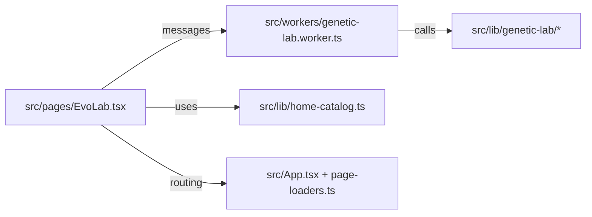

# Investigación profunda del repo ludario y propuesta de mini app de laboratorio evolutivo

## Resumen ejecutivo

El repositorio **ludario** es una SPA estática (corre 100% en el navegador) pensada como “hub” de herramientas y minijuegos livianos para juegos de mesa, cartas y puzzles, con un **Home** que funciona como catálogo unificado (filtros por etiquetas, búsqueda por chips y favoritos persistidos en `localStorage`). citeturn43view0turn26view0turn11view0turn12view0  

Técnicamente, está construido con **React 18 + TypeScript (strict)**, bundling con **Vite 5**, ruteo con **React Router + `HashRouter`** (especialmente útil para publicar en GitHub Pages sin configuración de servidor), y testing con **Vitest**. El despliegue se automatiza con workflows de CI y deploy. citeturn43view0turn23view0turn42view0turn25view0turn29view0turn30view1  

Hay patrones importantes ya “probados” en el repo que encajan perfecto con un laboratorio interactivo de algoritmos generacionales:  
- *Lazy-loading* de páginas (las “tools” se cargan bajo demanda) y *prefetch* suave desde Home. citeturn8view0turn11view0  
- Uso de **Web Worker** para simulaciones pesadas (ejemplo: `Chinchón Lab`) para no bloquear el main thread. citeturn26view0turn15view0turn17view0  
- Componentes de UI reutilizables para “lab” (tabs, paneles, acordeones, barra de acciones sticky) y estilos globales con utilidades ya disponibles. citeturn19view0turn22view0turn25view0  

**Propuesta**: incorporar una nueva mini app interna dentro del repo llamada **EvoLab** (ruta sugerida: `/#/tools/evo-lab`) para *jugar* con un algoritmo genético / evolutivo: elegir problema, ajustar parámetros (selección/cruce/mutación/población/elitismo/seed), correr generaciones y **visualizar** cómo cambia la población (animaciones + gráficas + tablas). El núcleo de cómputo viviría en `src/lib/` como lógica pura testeable, y la ejecución iterativa en `src/workers/` con mensajes stream hacia la UI, siguiendo la arquitectura ya usada en `Chinchón Lab`. citeturn26view0turn15view0turn17view0turn43view0  

No se especificaron restricciones de alcance (cantidad de problemas, tamaño máximo de población, ni requerimientos de persistencia/historial), así que se asume **“sin restricción”** y se propone una primera versión con defaults seguros y escalabilidad progresiva.

## Contexto técnico del repositorio

El repo se presenta como una biblioteca de herramientas web (sudoku, anotadores, juegos retro, laboratorio de bots) donde la navegación principal ocurre en **Home**, con catálogo filtrable y favoritos locales para entradas internas y externas. citeturn43view0turn26view0turn11view0turn12view0  

El stack y convenciones se describen explícitamente en la documentación interna del repo: React 18, TypeScript estricto, Vite 5, React Router 6 con `HashRouter`, CSS global + CSS Modules puntuales, Vitest, y deploy a GitHub Pages mediante GitHub Actions. citeturn26view0turn23view0turn42view0turn25view0turn30view1  

A nivel estructura, el repo separa claramente:  
- `src/pages/` para las páginas/rutas de cada tool. citeturn9view0  
- `src/lib/` para lógica pura reutilizable (con tests). citeturn6view0turn37view0turn38view0  
- `src/workers/` para cómputo pesado aislado (actualmente `chinchon-lab.worker.ts`). citeturn14view0turn15view0  
- `src/styles/` para CSS global y utilidades de layout (incluye estilos de “lab”). citeturn20view0turn22view0  
- `src/components/` para componentes chicos reutilizables (ej.: botón flotante “volver al inicio”). citeturn4view0turn5view0turn43view0  

La app usa `HashRouter` desde `src/main.tsx`, e incluye CSS global (entre ellos `chinchon-arena-utilities.css`, que define clases genéricas del estilo “lab” como `.lab-tabs`, `.lab-panel`, `.lab-accordion` y `.lab-action-bar`). citeturn25view0turn22view0  

La carga diferida y el prefetch siguen un patrón bien definido: `src/lib/page-loaders.ts` declara `pageLoaders` para imports dinámicos de páginas y `routePrefetchers` para precargar rutas específicas; Home invoca `prefetchRoute()` al “calentar” una card interna del catálogo. citeturn8view0turn11view0  

Finalmente, el caso más relevante para EvoLab: `Chinchón Lab` ya demuestra una arquitectura de cómputo intensivo con worker + tipos de mensajes (`src/lib/chinchon-lab-worker-types.ts`) y un worker que maneja jobs y cancelación por `jobId`. citeturn17view0turn15view0turn16view0turn26view0  

## Propuesta de mini app

**Nombre**: EvoLab  
**Ruta interna sugerida**: `/#/tools/evo-lab` (clave de loader sugerida: `evoLab`)  

**Objetivo**  
Crear un laboratorio visual e interactivo para explorar **algoritmos genéticos / evolutivos**: evolución de una población por generaciones mediante **selección**, **cruce (recombinación)** y **mutación**, guiado por una **función de aptitud (fitness)**. citeturn44search0turn45search2turn45search8  

**Alcance propuesto**  
- Versión inicial centrada en una representación **binaria (bitstring)**, porque permite visualizar “genes” como píxeles/tiles y hace muy evidente la mutación. Esta representación es común en introducciones a AG. citeturn44search0turn45search2  
- Al menos 1 problema base “didáctico” y altamente visual: **“copiar un patrón objetivo”** (target bitstring) donde la aptitud es el nivel de coincidencia con el target (equivalente a minimizar distancia de Hamming). Esto hace tangible la dinámica selección→cruce→mutación. citeturn44search0turn45search8  
- Presets adicionales escalables (recomendados) sin bloquear el MVP: optimización de función 1D codificada binariamente, o selección interactiva (humana) como fitness. En Wikipedia se menciona la existencia de enfoques de “algoritmos evolutivos interactivos” cuando el fitness es difícil de formalizar, lo que encaja como opcional a futuro. citeturn44search0  

**Principios de diseño alineados con ludario**  
- Sin backend, sin cuentas, todo local (coherente con el producto actual). citeturn26view0turn43view0  
- UI liviana y mobile-friendly: reutilizar el “look lab” existente (tabs, acordeones, action bar). citeturn19view0turn22view0  
- Cómpulto fuera del main thread: evoluciones/generaciones corren en Web Worker (como Chinchón Lab). citeturn26view0turn15view0turn17view0  

## Requisitos funcionales y configuraciones por defecto

La tabla siguiente prioriza requisitos (Obligatorios/Recomendados/Opcionales). Cuando el repo no define una convención, se asume **sin restricción** y se propone un default.

| Prioridad | Requisito | Descripción clara | Notas prácticas de implementación |
|---|---|---|---|
| Obligatorio | Crear experimento | Permitir elegir un “problema” (al menos 1 preset), inicializar población y configurar parámetros básicos (población, tasas, selección/cruce/mutación, elitismo, semilla). | El flujo “crear tool nueva” está documentado en el repo (crear página + ruta + entry en catálogo). citeturn43view0turn8view0turn13view0 |
| Obligatorio | Control de ejecución | Botones: **Iniciar / Pausar / Step (1 generación) / Reset**. | Similar a labs existentes: sticky action bar para acciones principales. citeturn19view0turn22view2 |
| Obligatorio | Ejecución no bloqueante | Evolución corre en **Web Worker** para que UI/animaciones sigan fluidas. | Patrón ya usado en `Chinchón Lab` con requests y cancelación. citeturn15view0turn17view0 |
| Obligatorio | Visualización de población | Mostrar la población actual y cómo cambia entre generaciones (ideal con animación). | Si el genotipo es bitstring, se puede renderizar como “mini-imagen” por individuo. citeturn44search0turn45search2 |
| Obligatorio | Métricas básicas | Graficar por generación: **best**, **promedio**, **peor** fitness; y mostrar “mejor individuo actual”. | Los AG evalúan fitness por generación y generan nueva población por operadores genéticos. citeturn44search0turn45search8 |
| Obligatorio | Semilla reproducible | Input de **seed** para repetir corridas (misma configuración → misma trayectoria estocástica). | No está especificado en el repo; se asume sin restricción. Recomendable para debugging y tests deterministas. |
| Obligatorio | Rango seguro de parámetros | Validar y “clamp” de parámetros para evitar estados inválidos (p. ej. población mínima, tasas 0..1). | El repo ya hace defensivo/clamp en configuraciones (ej. en Chinchón Arena clamping de valores). citeturn32view1 |
| Recomendado | Presets de configuración | Botón “Cargar preset” (p. ej. “Exploración alta”, “Convergencia rápida”, “Mutación alta”). | Mejora UX sin agregar dependencias. |
| Recomendado | Navegación de historial | “Scrubber” (slider) para volver a generaciones anteriores guardadas en memoria. | Mantener N generaciones (ej. 200) para no comer RAM. |
| Recomendado | Métricas de diversidad | Mostrar diversidad genética (ej. entropía por gen, distancia promedio). | Ayuda a explicar convergencia prematura, tema clásico en selección proporcional. citeturn45search3turn45search14 |
| Recomendado | Explicación didáctica inline | Panel “¿Qué está pasando?” que explique selección/cruce/mutación con el vocabulario del lab. | Wikipedia/recursos describen explícitamente el ciclo por operadores. citeturn44search0turn45search2turn45search8 |
| Opcional | Comparador de corridas | Guardar 2–3 corridas y superponer curvas de fitness. | Persistencia en `localStorage` como en Home favoritos (misma filosofía), pero no está requerido. citeturn11view0 |
| Opcional | Selección interactiva humana | Modo “fitness por usuario”: elegir qué individuos se reproducen. | Wikipedia menciona algoritmos evolutivos interactivos como variante. citeturn44search0 |
| Opcional | Export/Import de experimentos | Exportar configuración y/o snapshots como JSON (clipboard). | El repo usa patrones de serialización/clipboard en tools (p. ej. anotadores). citeturn43view0 |

### Parámetros del algoritmo y valores iniciales sugeridos

Los algoritmos genéticos suelen trabajar con población, fitness y operadores (selección, cruzamiento, mutación, reemplazo). citeturn44search0turn45search8turn45search2  

Tabla de parámetros recomendada para EvoLab (bitstring 8×8 = 64 genes como preset base):

| Parámetro | Default | Rango sugerido | Impacto esperado |
|---|---:|---:|---|
| `seed` | `12345` | entero 0..2^31-1 | Reproducibilidad. |
| `populationSize` | `96` | 20..400 | Más grande = más diversidad, más costo de CPU/visual. |
| `genomeLength` | `64` | 16..256 | En bitstring, más largo = espacio de búsqueda mayor. citeturn44search0turn45search2 |
| `elitismCount` | `2` | 0..10% de población | Mantiene mejores soluciones; reduce riesgo de “perder” el best por mutación. |
| `selection.method` | `tournament` | `tournament` / `roulette` | Torneo: presión ajustable por `k`. Ruleta: prob. proporcional al fitness relativo. citeturn45search1turn45search3 |
| `selection.tournamentK` | `3` | 2..9 | K mayor → presión mayor → convergencia más rápida (y potencialmente menos diversidad). citeturn45search1 |
| `crossover.method` | `onePoint` | `onePoint` / `twoPoint` / `uniform` | Recombinación combina características parentales. citeturn45search2 |
| `crossover.rate` | `0.85` | 0..1 | Probabilidad de aplicar cruce vs clonar. |
| `mutation.method` | `bitFlip` | `bitFlip` | “bitwise mutation” típica en bitstrings. citeturn45search14turn45search13 |
| `mutation.ratePerGene` | `0.015625` (≈1/64) | 0..0.2 | Muy bajo: estanca; muy alto: random walk. |
| `maxGenerations` | `300` | 10..5000 | Límite de corrida automática. |
| `tickMs` (UI) | `80 ms` | 0..500 | Controla velocidad/animación (sin afectar determinismo si el worker corre por pasos). |

### Ejemplos de configuración por defecto

Ejemplo 1: preset “Patrón objetivo 8×8” (MVP)

```json
{
  "problemId": "target-bitgrid",
  "seed": 12345,
  "populationSize": 96,
  "genomeLength": 64,
  "elitismCount": 2,
  "selection": { "method": "tournament", "tournamentK": 3 },
  "crossover": { "method": "onePoint", "rate": 0.85 },
  "mutation": { "method": "bitFlip", "ratePerGene": 0.015625 },
  "maxGenerations": 300
}
```

Ejemplo 2: preset “Exploración alta” (útil para ver mutación evidente)

```json
{
  "problemId": "target-bitgrid",
  "seed": 20260405,
  "populationSize": 140,
  "genomeLength": 64,
  "elitismCount": 1,
  "selection": { "method": "roulette" },
  "crossover": { "method": "uniform", "rate": 0.9 },
  "mutation": { "method": "bitFlip", "ratePerGene": 0.06 },
  "maxGenerations": 250
}
```

## Diseño de interfaces, flujos y visualizaciones

La UI propuesta reutiliza el lenguaje visual de “lab” ya existente (tabs sticky, paneles, acordeones), y se monta como una página en `src/pages/` como el resto de tools. citeturn19view0turn22view0turn43view0turn9view0  

### Pantallas (dentro de un único route)

| Pantalla/Tab | Contenido | Controles clave | Resultado visible |
|---|---|---|---|
| Experimento | Configuración del GA y del problema | Selector de problema, seed, sliders/inputs para población/operadores, botón “Reset” | Estado “listo para correr”; validación y defaults |
| Evolución | Ejecución y población “en vivo” | Iniciar/pausar/step, velocidad (ms), toggle “mostrar mutaciones”, selección de individuo | Animación de cambio generacional + mejor individuo destacado |
| Métricas | Análisis de trayectoria | toggles de series (best/avg/worst), ventana de generaciones, export CSV/JSON (opcional) | Curvas de fitness, diversidad, histograma de selección a lo largo del tiempo |

### Flujo de usuario principal

```mermaid
flowchart TD
  A[Home / Catálogo] --> B[EvoLab]
  B --> C[Configurar experimento]
  C --> D[Inicializar población]
  D --> E{Run mode}
  E -->|Step| F[Ejecutar 1 generación]
  E -->|Auto| G[Loop generaciones]
  F --> H[Render población + métricas]
  G --> H
  H --> I{Usuario ajusta parámetros}
  I -->|Sí| C
  I -->|No| J[Guardar/Comparar (opcional)]
```

### Interacciones clave que muestran “cómo muta” la población

Para cumplir el foco visual (“ver mutaciones”), se proponen tres representaciones complementarias:

- **Mosaico de población**: cada individuo es una mini-grilla (por ejemplo 8×8) donde 0/1 se ve como “apagado/prendido”. En cada nueva generación, el mosaico puede animar un “fade” o “flip” sutil, y marcar (overlay) los genes mutados del mejor individuo o del individuo seleccionado. Esto hace tangible el operador mutación. citeturn44search0turn45search2turn45search14  
- **Inspector de individuo** (drawer/modal simple): al clickear un individuo, mostrar: fitness, genoma, diff vs target (o vs best), parentA/parentB, punto(s) de crossover y lista de genes mutados. La recombinación es uno de los operadores centrales en AG, así que vale exponerla visualmente. citeturn45search2turn44search0  
- **Curvas de fitness por generación**: gráfica (canvas) con best/avg/worst. La idea de “generaciones evaluadas por aptitud” es el corazón del AG. citeturn44search0turn45search8  

### Métricas y visualizaciones sugeridas

| Métrica | Cómo se calcula | Visualización | Para qué sirve |
|---|---|---|---|
| Best fitness | max(fitness_i) | Línea + badge grande | Ver progreso “optimización” |
| Fitness promedio | mean(fitness_i) | Línea | Medir “salud” global |
| Worst fitness | min(fitness_i) | Línea tenue | Detectar colas malas |
| Diversidad por gen | frecuencia de 1s por posición (o entropía) | Heatmap genes×generación (opcional) | Ver colapso a consenso |
| Distancia al target (si aplica) | genomeLength - fitnessMatch | Línea | Interpretación más intuitiva |
| Presión de selección | conteo de parent picks por individuo | Histograma por generación (opt) | Comparar torneo vs ruleta |
| Tasa real de mutación | (#bits mutados)/(pop*L) | Número + sparkline | Depurar y enseñar mutación |

Notas: la selección por torneo es ajustable por `k` y suele ser fácil de implementar y eficiente; la selección por ruleta asigna probabilidad proporcional al fitness relativo y puede converger prematuramente si unos pocos dominan. citeturn45search1turn45search3turn45search14  

## Modelos de datos, motor GA y APIs internas

En ludario, la lógica compleja suele ir como funciones puras en `src/lib/` (testeables con Vitest) y, cuando hay cómputo intenso, se delega a un worker con un contrato de mensajes tipado. citeturn6view0turn37view0turn38view0turn15view0turn17view0  

### Modelo de datos principal

Propuesta de tipos (TypeScript) para el motor de EvoLab (resumen conceptual):

- **Genome**: `Uint8Array` de 0/1 (bitstring), o `number[]` si se prefiere simplicidad.  
- **Individual**:  
  - `id: number | string`  
  - `genome: Genome`  
  - `fitness: number`  
  - `meta?: { parentAId?: id; parentBId?: id; crossoverPoints?: number[]; mutatedGenes?: number[] }`  
- **PopulationSnapshot**:  
  - `generation: number`  
  - `individuals: Individual[]` *(o una versión compacta para UI)*  
- **ExperimentConfig** (persistible): parámetros del GA + problema + límites + seed.  
- **MetricsTick**: `generation`, `best`, `avg`, `worst`, `diversity`, etc.

Esto refleja el esquema clásico: población de individuos con genotipo, fitness, y operadores que generan nuevas generaciones. citeturn44search0turn45search8turn45search2  

### APIs internas necesarias (contratos sugeridos)

En `src/lib/genetic-lab/` (lógica pura):

- `createRng(seed): RNG`  
- `initPopulation(cfg, rng): PopulationSnapshot`  
- `evaluatePopulation(pop, problem): PopulationSnapshot`  
- `selectParents(pop, cfg.selection, rng): [idxA, idxB][]`  
- `crossover(genomeA, genomeB, cfg.crossover, rng): { childA, childB, meta }`  
- `mutate(genome, cfg.mutation, rng): { genome, mutatedGenes }`  
- `nextGeneration(pop, cfg, rng): { pop: PopulationSnapshot; metrics: MetricsTick }`  
- `computeMetrics(pop, target?): MetricsTick`

En `src/workers/genetic-lab.worker.ts` (loop / streaming):

- Manejo de `jobId` + `cancel` (consistente con el worker existente). citeturn16view0turn17view0  
- Requests sugeridos:  
  - `initExperiment` (set config + build gen0)  
  - `step` (1 generación)  
  - `run` (N generaciones con yield periódico)  
  - `cancel`  
  - `inspectIndividual` (opcional: pedir detalle puntual sin mandar toda la población siempre)

Mensajes hacia UI (UI-friendly):

- `generationUpdate` con snapshot compacto + métricas  
- `runDone` / `error`

La idea de “yield” para mantener responsiveness está ya implementada en el worker de Chinchón Lab con pausas `setTimeout(0)` durante loops grandes. citeturn16view1turn15view0  

### Representación del problema: interfaz “pluggable”

Para permitir crecer sin reescribir el motor:

- `ProblemDefinition`:
  - `id`, `title`, `description`
  - `genomeLength` (o calculable)
  - `createTarget?()` (si aplica)
  - `fitness(genome, ctx): number`
  - `renderHint?()` (para UI: labels, escalas, etc)

Esto está alineado con la idea de que AG opera sobre “soluciones codificadas en cromosomas” evaluadas por una medida de aptitud. citeturn44search0turn45search8  

## Integración con la arquitectura existente, escenarios de prueba y estimación de esfuerzo

### Archivos a modificar o añadir

El repo tiene un checklist claro para “agregar una nueva herramienta”: crear página + sumar ruta + sumar entry al catálogo; y mantener docs alineadas. citeturn43view0turn26view0turn27view0  

Cambios propuestos (mínimo viable y ordenado por impacto):

| Archivo/Carpeta | Acción | Motivo |
|---|---|---|
| `src/pages/EvoLab.tsx` | **Nuevo** | Página principal del laboratorio (tabs + panels + canvas) siguiendo el patrón de otras tools. citeturn9view0turn43view0 |
| `src/pages/EvoLab.module.css` | **Nuevo** | Estilos puntuales (si lo global no alcanza). citeturn43view0 |
| `src/lib/genetic-lab/` | **Nuevo** | Motor GA puro: operadores, problemas, métricas, RNG; 100% testeable. citeturn6view0turn38view0 |
| `src/lib/genetic-lab-worker-types.ts` | **Nuevo** | Contrato tipado request/response para worker (como `chinchon-lab-worker-types.ts`). citeturn17view0 |
| `src/workers/genetic-lab.worker.ts` | **Nuevo** | Ejecuta generaciones sin bloquear UI (modelo jobId/cancel). citeturn15view0turn16view0 |
| `src/lib/page-loaders.ts` | **Modificar** | Agregar loader `evoLab` y su entrada en `routePrefetchers`. citeturn8view0 |
| `src/App.tsx` | **Modificar** | Registrar route `"/tools/evo-lab"` e integrar lazy loading (como el resto de tools). citeturn43view0turn8view0 |
| `src/lib/home-catalog.ts` | **Modificar** | Agregar item interno al catálogo (`CATALOG_ITEMS`) con tags existentes para filtrar. citeturn13view0turn43view0turn12view0 |
| `README.md` | **Modificar** | Documentar tool nueva en lista de herramientas + rutas. citeturn43view0 |
| `CLAUDE.md` y `AGENTS.md` | **Modificar** | Mantener “alineados” catálogo/arquitectura/rutas (lo piden explícitamente). citeturn26view0turn27view0 |

Entrada sugerida en `home-catalog.ts` (concepto; valores a ajustar a gusto):

- `id/to`: `/tools/evo-lab`  
- `tags`: usar tags existentes para evitar trabajo extra de filtros (ej. `['Herramienta']`) citeturn13view2turn26view0  
- `collection`: `laboratory` (ya existe en el catálogo). citeturn13view3  

### Escenarios de prueba y casos de uso

El repo usa Vitest para tests; hay ejemplos claros de funciones de `src/lib/` testeadas con `describe/it/expect`, lo que sugiere que el motor GA debería tener una batería robusta de unit tests. citeturn23view0turn38view0turn29view0  

Tabla de escenarios (mezcla de unit + manual QA):

| Escenario | Tipo | Qué valida | Criterio de éxito |
|---|---|---|---|
| Init con seed fija | Unit | Determinismo del RNG + init population | Con misma config+seed, gen0 idéntica |
| Mutación rate=0 | Unit | Operador mutación | Genoma no cambia, mutatedGenes vacío |
| Mutación rate=1 | Unit | límites | Todos los genes flippean (o casi, según definición) |
| Crossover one-point | Unit | recombinación correcta | Hijos combinan prefijo/sufijo de padres citeturn45search2 |
| Tournament k=1 | Unit | selección | Selección ~ aleatoria (sin sesgo fitness) citeturn45search1 |
| Tournament k=pop | Unit | presión máxima | Siempre elige el mejor individuo del torneo citeturn45search1 |
| Roulette con fitness heterogéneo | Unit | selección proporcional | Frecuencia de picks ~ proporcional al fitness relativo citeturn45search3turn45search14 |
| Worker cancel | Integración | no bloqueo y cancelación | `cancel` detiene run; UI no se congela citeturn16view0turn15view0 |
| UI step-by-step | Manual | UX y coherencia | 1 click = 1 generación; métricas se actualizan |
| Mobile portrait | Manual | layout responsive | Tabs sticky y canvas legible; sin overflow roto citeturn22view0 |
| Parámetros fuera de rango | Manual/Unit | validación/clamp | sistema corrige y no crashea |

### Estimación de esfuerzo por componente

Estimación orientativa (supone 1 dev, sin restricciones externas y sin agregar librerías de terceros; si se agregan dependencias de charting, el esfuerzo puede bajar en UI pero sube en integración/riesgo).

| Componente | Entregables | Horas (rango) | Dependencias |
|---|---|---:|---|
| Diseño UX + wireflow | Tabs/paneles, jerarquía de controles, defaults | 6–10 h | Ninguna |
| Motor GA en `src/lib/` | Operadores, problemas, métricas, RNG | 10–16 h | Ninguna |
| Worker | Loop, jobId/cancel, mensajes update | 6–12 h | Motor GA citeturn15view0turn17view0 |
| UI base (React) | Tabs, forms, action bar, estado | 10–16 h | Worker/types + estilos lab citeturn19view0turn22view0 |
| Visualizaciones | Mosaico población + curvas fitness + inspector | 14–24 h | UI base |
| Persistencia | Guardar última config, presets, export/import (opcional) | 4–10 h | UI + modelo |
| Tests (Vitest) | suite “motor GA” (prioridad alta) | 8–14 h | Motor GA citeturn38view0turn29view0 |
| Integración repo + docs | rutas/loaders/catalog + README + CLAUDE/AGENTS | 4–8 h | Todo lo anterior citeturn43view0turn26view0turn27view0turn8view0 |

**Total estimado**: 62–110 horas (≈ 8–14 días laborales de 8h), dependiendo del nivel de pulido visual y de cuánta instrumentación de diversidad/historial se incluya en la v1.

### Diagrama de módulos propuesto



El enfoque (lógica pura en `src/lib/`, simulación en worker) replica el patrón ya documentado para la tool más compleja del repo (`Chinchón Lab`), reduciendo riesgo técnico y evitando bloquear la interfaz. citeturn26view0turn15view0turn17view0